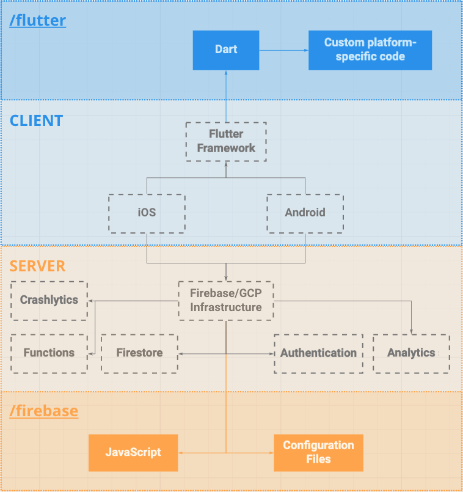

Table of Contents
- [Architecture](#architecture)
  - [Overview](#overview)
    - [`/flutter`](#flutter)
    - [`/firebase`](#firebase)
    - [One last thing](#one-last-thing)
  - [`.vscode/`](#vscode)
  - [Release](#release)

# Architecture

Memo's architecture is quite simple, as it delegates all of the hardcore/complex foundations to its vendors. With that
said, we still have to write a decent amount of code to reach our goals and, if we don't output quality code, things
will get messy pretty quickly - yeah, Sherlock stuff here, like it's not a common ground for basically **any software**.

In simple terms, `/flutter` is where all of our client-side source files will live - using Flutter as its engine to
output binaries for all platforms that Memo support. For the server-side contents, Firebase is used, hence all files
related to the server belong in `/firebase`.

> While you should (if you have past experiences with it) understand the root folder's structure of the `/flutter` 
> project, the `/firebase` project might be quite unusual, to say the least. It may be valid to get deeper into it 
> through [Firebase ARCHITECTURE.md](flutter/ARCHITECTURE.md), as this is an overview of the whole architecture. 
 
## Overview

As you can see, this is a really simplistic overview of how things work. Those boxes inside the blue container belongs
to the client-side and, inside the orange container, are the server-side ones. Now, boxes with a dotted border are the
vendors that we interface with, accessed through each platform's APIs (Flutter SDK and Firebase SDK, in this case), and
colored boxes live here in this repository, they are our beloved source files.

### `/flutter`

Inside the `/flutter` container, we have all of our `Dart` files, which composes almost everything that we need to
create a Flutter hybrid application. There are some `Custom platform-specific code` which can be eventually required,
called through platform channels in Dart. Everything else is handled by the `Flutter Framework`, which is used/uses all
supported platforms, like `iOS` and `Android`.

### `/firebase`

`JavaScript` is to `/firebase`, just like `Dart` is to `/flutter`, even though you can see that we use only `TypeScript`
- that's because `TypeScript` is just a superset on top of the `JavaScript`, at the end, it outputs `JavaScript` files.
But, here's the catch: because the `Firebase/GCP Infrastructure` provides so much built-in functionality, there is a
bunch of stuff that we can do without writing a single line of code. To configure behaviors of these complex services
provided to us through a simple API, we use some `Configuration Files` - things like rules of our database
(`firestore.rules` in our case).

### One last thing

... but not less important: this is **heavily influenced** by a bunch personal opinions and experiences in some
production projects that the team has worked on. This project's external dependencies will keep changing as the time
goes on, Flutter and Firebase will also keep evolving, and we have to adapt in a way to maintain consistency, integrity
and scalability of our solution. So, it's probable that there is (and will be) better ways to achieve the same
goals/objectives. For this, we look into your help to make this project's architecture continuously provide a good
developer experience to add new features, update old ones and keep those nasty bugs away.

## `.vscode/`

While this project heavily enforces that vscode should be used, IntelliJ is also an alternative, although it won't
provide the best experience with the setup made in this repository. If you still prefer to use it, there should be no
problem at all, just make sure to follow the same guidelines specified in
[Flutter's `settings.json`](flutter/.vscode/settings.json) and
[Firebase's `settings.json`](firebase/.vscode/settings.json), both which are prepared to automatically apply the
standard style + format to all Memo's source files.

All configuration files lives under the respective project's `.vscode` folder and - while there are some that will
disagree with this decision - **should be git-tracked**.

  - `launch.json` is where common scripts for running the application (plus environment) can be found.
  - `settings.json` is responsible for the editor configurations, rules and auto-format on save.
  - `extensions.json` are the recommended extensions that we think will make your life easier.

> Tip: you can take advantage of the VSCode functionalities and automatically install all recommended extensions at
> once, instead of manually searching for each extension id.

## Release

Releases are fully-automated using Github Actions. Each sub-project (`/flutter` and `/firebase`) have their own scripts
that run when some _development lifecycles_ conditions are met.

You can read more about these in [`/flutter` Release](flutter/ARCHITECTURE.md#release) and
[`/firebase` Release](firebase/ARCHITECTURE.md#release) `ARCHITECTURE.md` files.