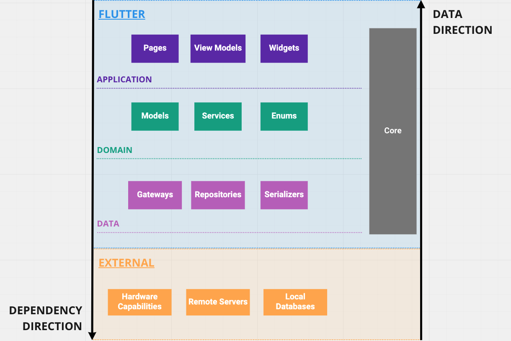
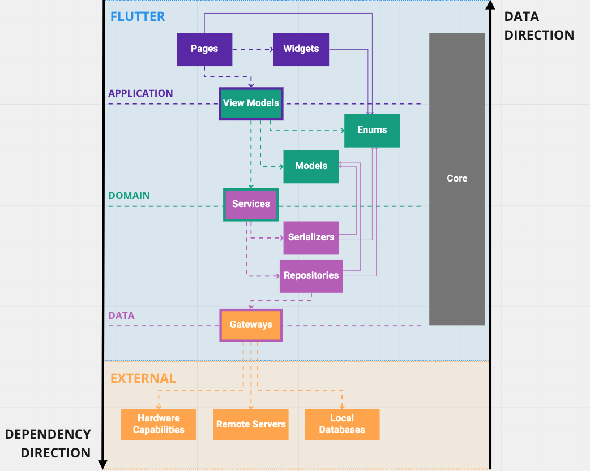

Table of contents
- [Architecture](#architecture)
  - [`.vscode/`](#vscode)
  - [`android/` - Android required files](#android---android-required-files)
  - [`ios/` - iOS required files](#ios---ios-required-files)
  - [`lib/` - Flutter application](#lib---flutter-application)
    - [Why](#why)
    - [Overview](#overview)
    - [`application/`](#application)
      - [`constants/`](#constants)
      - [`coordinator/`](#coordinator)
      - [`pages/` (views)](#pages-views)
      - [`theme/`](#theme)
      - [`utils/`](#utils)
      - [`widgets/`](#widgets)
      - [`widgets/material/`](#widgetsmaterial)
      - [`widgets/themed/`](#widgetsthemed)
      - [`view_models/`](#view_models)
    - [`domain/`](#domain)
      - [`enums/`](#enums)
      - [`isolated_services/`](#isolated_services)
      - [`models/`](#models)
      - [`services/`](#services)
      - [`transients/`](#transients)
    - [`data/`](#data)
      - [`repositories/`](#repositories)
      - [`gateways/`](#gateways)
      - [`serializers/`](#serializers)
    - [`core/`](#core)
      - [`faults/`](#faults)
  - [`test/` - Unit and UI testing](#test---unit-and-ui-testing)
    - [`utils/`](#utils-1)
    - [`fixtures/`](#fixtures)
  - [`web/`](#web)
- [Relevant Topics](#relevant-topics)
  - [Why `river_pod` and not "x" state management library?](#why-river_pod-and-not-x-state-management-library)
  - [Why `mocktail` and not `mockito`?](#why-mocktail-and-not-mockito)
  - [`CoordinatorRouter` and `Router` (or Navigator 2.0)](#coordinatorrouter-and-router-or-navigator-20)
  - [Why manually importing the font, if there is the `google_fonts`?](#why-manually-importing-the-font-if-there-is-the-google_fonts)
  - [Importing Fonts](#importing-fonts)
  - [Exception handling](#exception-handling)
  - [App Icon](#app-icon)
  - [Environment](#environment)
  - [Firebase](#firebase)
  - [Release](#release)

# Architecture

## `.vscode/`

There is not much to add on top of the [General ARCHITECTURE.md .vscode section](//TODO), although for this Flutter
project, the explanation for the recommended extensions:

- Dart (id: dart-code.dart-code) - makes `Dart` development **way** more productive;
- Flutter (id: dart-code.flutter) - makes `Flutter` development **way** more productive;
- Brack Pair Color (id: coenraads.bracket-pair-colorizer) - useful when dealing with nested/verbose widgets.

It's highly recommended to, at least, add the `Dart` and `Flutter` extension, as they provide an absurd amount of useful
features.

## `android/` - Android required files

Stores all required (and generated) files to output builds for the Android platform.

This is where native Android (Kotlin) code also lives, if there is a need to implement native-specific features.

## `ios/` - iOS required files

Stores all required (and generated) files to output builds for the iOS/iPadOS platforms.

This is where native iOS (Swift) code also lives, if there is a need to implement native-specific features.

## `lib/` - Flutter application

Entry point to the Flutter application, where most of the *action* will happen.

### Why

> You can skip this explanation, this is just an overview on the topic of why we have decided to go with this particular
> architectural approach.

At first glance (looking at the name of the topmost folders), with the objective of defining its layers and the
respective interactions, you may question yourself if this project is using
[clean architecture](http://blog.cleancoder.com/uncle-bob/2012/08/13/the-clean-architecture.html), 
[domain driven design (DDD)](https://martinfowler.com/bliki/DomainDrivenDesign.html) or even some pieces of
[MVVM](https://en.wikipedia.org/wiki/Model%E2%80%93view%E2%80%93viewmodel). Now, when you start reading it and finding
out which part depends on what - and what they expect to execute their responsibilities -, you may wonder about things
like "entities are not mapped to models!", "where are the use-cases?" and questions about the fact that this approach
**doesn't follow these architectures principles**. Why is that?

Well, clean architecture was originally intended for robust/enterprise-like applications that have to deal with a ton of
business-logic complexity and highly-verbose dependencies - such as libraries, frameworks and any external resources.
While this is a frequent scenario in the present state of software applications, **this project is definitely not the
case of a highly-complex scenario** - it may evolve to be complex enough, but it won't exceed the complexity of being a
REST-consuming client that **focuses** much more on the presentation layer than anything else.

Nowadays, simpler architectural designs like MVC/MVVM/MVP are much more common in client applications due to this exact
fact: a overcomplex and high boilerplate architecture doesn't provide any significant value - they make things harder
and slower with no clear benefit other than separating a bunch of layers **for the sake of separating them**. But they
come with a price: there is no clear distinction in between **Business Logic and Data manipulation** if you don't
enforce such standards.

No, we won't remove the classic separation of "View <-> Business Logic <-> Data" relationship, it's just that, in this
case, **we think that following every nook and cranny of part of these architectures would be overengineering**, thus
making things slower just to follow some principles that don't necessarily apply to this case. This approach will surely
not make sense (or even be completely dumb) for some, but may be good for others.
[Relevant xkcd](https://xkcd.com/927/).

Please, keep the [General ARCHITECTURE.md](../ARCHITECTURE.md#one-last-thing) introduction in mind - there are a ton of
personal opinions and experiences here. This means that there **will be better ways to build what we've done**, and it's
what we are aiming for: your help to improve this architecture over the time.

### Overview

The picture above gives us a really simplified overview of each major layer that gives shape to this application.

If you don't want to dig in on what each part is responsible of (and why), here is a TLDR:
  - `application`: all interface elements (widgets) alongside its view models (may contain validation and such business 
  logic), the latter which communicates with the `domain`;
  - `domain`: handles most of the business logic and if necessary, make the respective calls to the `data` layer;
  - `data`: retrieves and modifies any data, without the knowledge of any other layers whatsoever. This is the
  lower-boundary of our application that communicates with external frameworks and libraries;
  - `core`: shared functionality to all layers.

Now, if you want to take a closer inspection on each interaction of each layer, the image below might be more suited to
comprehend exactly how each layer (and its exceptions) interacts/depends on others. 

- The dotted arrow means a direct dependency, such as the connection between *View Models -> Services*. These
connections require that the communication should always be made through an interface and following the
[dependency inversion principle (DiP)](https://en.wikipedia.org/wiki/Dependency_inversion_principle);
- The straight line means a direct association or usage, such as the connection between *View Models -> Models*;
- The smaller straight line also means a direct association or usage, such as the connection between *Pages -> Enums*.
The difference from the bigger ones is that these "cross-boundaries" between layers in a non-traditional way - through
interactors like *View Models* (that connects the `application` with `domain`), *Services* (that connects the `domain`
with `data`) and *Gateways* (that connects `data` with external dependencies).

All of the interactions above are explained in their respective sections below.

### `application/`

The topmost layer, the entry point of all user interactions, which depends directly on Flutter to function properly.
The `application` should be responsible only for rendering elements and capturing inputs, touches, and any interaction
that comes directly from the user, alongside the interface's capabilities, like scroll, navigation, responsivity,
etcetera.

Rules about each `application/` structure's responsibilities:
- It should never **interact** with any layer other than its own sub-folders;
- It should never **access** any other layer classes (not even indirectly).

Two exceptions for the above:
- These structures can **access** the [`domain/enums`](#enums) - while it exposes a piece of the `domain` layer, we 
consider this to be an acceptable exception (explained in [`data/`](#data));
- The **[ViewModels (VMs)](#view_models)** can **interact** with the `domain/` because they are the structure that
allows us to, in only *one-way*, cross boundaries from the `application` to the `domain`.

#### `constants/`

Stores any kind of constant, like images, strings, themes, etcetera.

#### `coordinator/`

Allows us to take control over our routing and navigation, in close contact with the `Flutter` framework to do so.

The responsibility of the coordinator is to make all of those pesky deep-linking and navigation stack problems become
easier to deal with.

#### `pages/` (views)

Each page is normally associated with a `Scaffold`, that represents all the contents of a single `MaterialPageRoute`,
which is controlled by the `CoordinatorRouter`.

These `pages` are the only elements that can access the [`view_models/`](#view_models).

#### `theme/`

Specialized implementations that deal with the `Flutter` framework's Theme (more specifically, the `ThemeData`).

Because of some known limitations of the `MaterialApp` theme handling, there are some custom implementations like the
`ThemeController`, which provides extra functionality on top of the material's default.

#### `utils/`

UI-related utilities like formatting, widgets helpers, animations, painters, etcetera.

#### `widgets/`

Individual `Widget`s that represent some custom visual element that is reused in multiple different
[`pages`](#pages-views) or even other `application/widgets`. These should not know anything about VMs, pages, or
anything other than `application/utils` and `application/constants`. They should be **pure** and **independent**.

#### `widgets/material/`

Same as the [`widgets`](#widgets/), but specific to the `flutter/material` library, which means that they can only exist
below (as a child) of a `MaterialApp`.

#### `widgets/themed/`

Same as the [`widgets`](#widgets/), but requiring a `ThemeController` as a parent. It also (usually) means that they
depend on the `flutter/material` library as well. This is because the current theme implementation is tightly coupled to
the flutter's implementation of the material framework - make no mistake, this is an intended decision, as the material
framework provide an enormous amount of useful features by default, mainly related to accessibility and animations.

#### `view_models/`

The boundary between the [`application/`](#application) and [`domain/`](#domain). The ViewModels, (suffixed with `VM`
in each class), always should be built upon an interface (following the DiP) and should never - ever - know anything
about the UI, meaning the `flutter` framework - but maybe some constant stuff like `Platform` and core
meta-functionality, but never anything related to the layout per-se.

They should never depend on each other, meaning that no `VM` class should ever be nested, as to avoid circular
dependencies.

The `VM`s are the only structures in [`application/`](#application) that communicates with inner layers, more
specifically, with the [`domain/`](#domain). In the process of achieving this, it will inevitably leak some of the core
business logic (things like input validation) that should be mostly contained in the [`domain/`](#domain) layer.

### `domain/`

The intermediate layer. Using the core structures (models, entities and enums), the domain is where all the business logic
should be contained, by accessing the [`repositories`](#repositories) to achieve its goals.

Rules about each `domain/` structure's responsibilities:
- It should never **interact** with any layer other than its own sub-folders;
- It should never **access** any other layer classes (not even indirectly).

One exception for the above:
- The **[Services](#services)** can **interact** with the `data/` (through the [`repositories`](#repositories)) because 
they are the structure that allows us to, in only *one-way*, cross boundaries from the `domain` to the `data`.

#### `enums/`

They are just like our [`models`](#models) - a data structure that represent part of our business, but with the
difference that it can be *described* statically (they are constant).

> These are the only structures that can be accessed (or leaked) to the views due to its constant nature. It provides a
> type-safety when dealing with these cases and if we don't actually leak it, normally what we have is a duplication of
> this same enumerator behavior in the UI, but less type-safe (or just replicating the exact same behavior).

#### `isolated_services/`

Just like a regular [`services`](#services), but as the name states, it should be always completely isolated from any
dependency. Think of the regular `services` as "impure" business logic, meaning that they need to use external
dependencies interfaces, like databases, file system, etcetera, and the `isolated_services` as completely "pure"
business logic, as it only requires to know the logic itself and nothing else.

Because these are independent, the impure `services` may use them as dependencies, as it would never create a cyclical
reference problem.

#### `models/`

A domain model - a set of structures that represent a business object.

#### `services/`

The boundary between the [`domain/`](#domain) and [`data/`](#data). Each service (suffixed with `Service` in each
class) should always be built upon an interface (following the DiP) and should never depend on each other, meaning that
no `Service` class should ever be nested, as to avoid circular dependencies.

The `services/` should contain all the heavy business logic associated with each `model` in our project. They are
usually split to represent each [`models/`](#models) related business logic, but this could be split in even smaller
structures (called Use Cases in the clean architecture) if proven necessary.

They are the only structures in [`domain/`](#domain) that communicates with the [`data/`](#data) layer, more
specifically, through the [`repositories/`](#repositories).

#### `transients/`

Just like the [`models/`](#models), the `transients` represent a set of business structures, although there's a
clear distinction between these and `models` - they exist only in memory, meaning that they make sense only in some
particular contexts required by the application's lifecycle.

<!-- TODO(matuella): Add an example, this is too broad of a definition -->

### `data/`

The bottom layer. Communicates with raw libraries and frameworks to consume its raw data and expose it to its consumer.
These libraries and frameworks are abstractions (interfaces, following the DiP) to access things like remote servers,
hardware capabilities (audio, video, geo), databases, etcetera.

Rules about each `data/` structure's responsibilities:
- It should never **interact** with any layer other than its own sub-folders;
- It should never **access** any other layer classes (not even indirectly).

One exception for the above:
- Both [`serializers/`](#serializers) and [`repositories/`](#repositories) can **access** the [`enums/`](#enums) and
[`models/`](#models) - while it exposes a piece of the `domain` layer, we consider this to be an acceptable exception
(explained below).

Just like we have decided to expose the `enums/` to the interface, we also agreed to expose both `enums/` and
`models/` to the [`serializers`](#serializers) and [`repositories`](#repositories). The alternative here was to 
[create intermediate data models (DTOs)](http://blog.cleancoder.com/uncle-bob/2012/08/13/the-clean-architecture.html#what-data-crosses-the-boundaries),
but *separating the domain model from this exact copy (DTO) doesn't provide any meaningful solution to this
architecture* (I like [this answer in StackExchange](https://softwareengineering.stackexchange.com/a/388545) about the
same exact issue).

#### `repositories/`

Interfaces the access to external libraries - that crosses the boundary of our application - to the
[`services`](#services). The `repositories` can be considered like *interface adapters*, allowing an independency when
making changes to the implemented technologies, affecting only this layer (and obviously the technology implementation
itself).

Each of these *adapters* are suffixed with `Repository`, built upon interfaces (following the DiP), and should never
depend on each other, meaning that no `Repository` class should ever be nested, as to avoid circular dependencies.

There are use-cases where multiple repositories require making use of the exact same abstraction of some third party
library, such as accessing a local database, which requires much more than simply importing an external package. In
these cases, a `Repository` should be injected with such abstraction, namedly the [`gateways`](#gateways), as to not
repeat ourselves too much when dealing with major third parties.

#### `gateways/`

As commented in [`repositories`](#repositories), these are pure/raw access to libraries, databases and all external
dependency that crosses the boundary of our application, which can be used solely by these same `repositories` - because
a greater abstraction turned out to be necessary.

These should be built like any other major structure, through interfaces, following the DiP and do not depend on each
other - to avoid circular dependencies.

Also, because gateways are "rare naming" occurrence in most architectures,
[here is the reference of why](https://martinfowler.com/eaaCatalog/gateway.html).

#### `serializers/`

Instead of a codegen approach (due to the drawbacks of being dependent of auto-generating the parsing of our core
models), we decided to go with the manual serialization. The `serializers/` exist with the sole purpose of translating
[`models/`](#models) to/from a raw structure.

### `core/`

Fundamental functionality to all the layers (being accessed by any of them), but doesn't know about their existence.
In terms of knowledge, they are similar to the [`data/`](#data) layer, other than the fact that the `data/` layer itself
can access `core/`.

The `core/` shares functionality like [`faults/`](#faults), environment management, project-wide constants, etcetera.

#### `faults/`

Has all the project's custom `Error`s and `Exception`s classes.

## `test/` - Unit and UI testing

Nothing out of the ordinary here, we simply make a mirror of the `lib/` folder structure within `test/`. I.e. if we have
a file that is `lib/application/widgets/custom_container.dart`, we would have a mirrored
`test/application/widgets/custom_container_test.dart`.

Due to some [limitations of the dart language](https://github.com/dart-lang/language/issues/1482) and the new
null-safety approach, [`mockito`](https://github.com/dart-lang/mockito) is now using a codegen to mock, which we
honestly think that [`mocktail`](https://github.com/felangel/mocktail) is a better alternative.

If you are using `vscode` IDE, you can call the `Dart: Run All Tests` command to run all tests and get a report on the
results.

### `utils/`

Shared functionality amongst all test cases.

### `fixtures/`

Tests [fixtures](https://en.wikipedia.org/wiki/Test_fixture#Software) - here is a
[good SO answer](https://stackoverflow.com/a/14684400/8558606) explaining what they represent. In our scenario, they
usually represent raw data, models or entities.

## `web/`

Stores all required (and generated) files to output builds for the Web platform. Currently not supported.

---

# Relevant Topics

These are points that aren't directly related to the folder structure and each responsibility, but things that also
permeates the knowledge required to fully understand this architecture.

## Why `river_pod` and not "x" state management library?

With the past experiences with libraries like the native `InheritedWidget`, `Provider` and `Bloc`, we had found that
they tend to be quite verbose (thus bloating the code) and limited in some scenarios. Diving into each of these
particularities would be a long discussion, but
[`river_pod` has a brief explanation](https://github.com/rrousselGit/river_pod#why-another-project-when-provider-already-exists)
on why it solves such problems and why it's better to use it.

## Why `mocktail` and not `mockito`?

After NNBD, `mockito` is using a codegen approach to deal with mocks, which we quite dislike given that there is no
clear benefit when comparing to `mocktail`. There is an [open issue](https://github.com/dart-lang/mockito/issues/347) to
merge mocktail into `mockito`, but until then (assuming it will be merged), we think that the same functionalities will
continue to work using `mocktail` only.

## `CoordinatorRouter` and `Router` (or Navigator 2.0)

This was probably one of the decisions that we still are somewhat unsure about. To not go into a lot of the details,
instead of using external libraries routing libraries (like `vrouter`, `auto_route` and `beamer`), we decided to take a
shot on doing our own implementation of the Navigator 2.0 (or Router), because we believed that it could give us a much
more fine-grained (and less bloated) implementation of what we consider a coordinator pattern (name more frequent in the
iOS development ecosystem, but what we consider our router).

While we are quite content with the result, that the solution matched our preference (personal opinion) of splitting the
application pages in a complete separate class from the router/coordinator (contrary to what most of the routing
libraries do), and access it call navigatons, we are not so sure about the future of the Navigator 2.0 and how
hard/verbose it can become. We didn't quite like the API and it may be a point of difficult fixes/updates in the future.

There is an [research](https://github.com/flutter/uxr/wiki/Navigator-2.0-API-Usability-Research) going on to improve
Flutter's Navigator API, so we should keep track of its evolution and how it may improve our solution.

While the Flutter framework doesn't provide an improved version of the current Navigator 2.0 state **AND IF** the
current coordinator proves to be more of a burden than a help, we should migrate to one of the libraries mentioned
above.

## Why manually importing the font, if there is the `google_fonts`?

Four main points for this decision:

- The `google_fonts` package makes an async request to lazily load its fonts, meaning that it will fallback to the
unsupported font (it will not crash, but will be visually inconsistent with what we expect from a decent UI);
- We wouldn't benefit from the `google_fonts` default implementation of the project's fonts, as we have a custom layout
for each material's text theme;
- The current version of memo doesn't require any internet connection to work, so it would also mean a bad user
experience for offline users;
- It's a new dependency (meaning more possible future problems) for the project.

The only drawback of doing this manually is importing the fonts in the `assets/` folder (size shouldn't be relevant to
impact even low-end devices), and specifying them in the `pubspec.yaml`.

## Importing Fonts

To import fonts, into this project, one should:
1. Add all font files to `assets/fonts` following the weight/name guidelines below:
    - `100`: `"{font_name}-Thin.{ttf || otf}'`;
    - `200`: `"{font_name}-ExtraLight.{ttf || otf}'`;
    - `300`: `"{font_name}-Light.{ttf || otf}'`;
    - `400`: `"{font_name}-Regular.{ttf || otf}'`;
    - `500`: `"{font_name}-Medium.{ttf || otf}'`;
    - `600`: `"{font_name}-SemiBold.{ttf || otf}'`;
    - `700`: `"{font_name}-Bold.{ttf || otf}'`;
    - `800`: `"{font_name}-ExtraBold.{ttf || otf}'`;
    - `900`: `"{font_name}-Black.{ttf || otf}'`.
2. Update the `pubspec.yaml` `flutter.fonts` property with the new fonts naming/weights;
3. Follow the type-safe usage of `FontKey` enumerator in `constants/fonts.dart`.

## Exception handling

Currently, because the application has almost no async interactions, other than fetching local files and databases,
which rarely fails if comparing to network requests (and when it fail, probably throws an `Error` and not an
`Exception`).

This is one of the main reasons that this application doesn't have much to deal when we are talking about exception
handling, altough there is an use-case that justified the creation of this layer that handles an `Exception`, which are
failures expected in runtime and we should handle them properly, so the user can know exactly what went wrong.

The exceptions are presented using `SnackBar`s and, using a simply global (but not static) approach, we provide our own
`GlobalKey<ScaffoldMessengerState>()` instance to `MaterialApp`, so we can freely access this same key using the same
instance provided to the `MaterialApp`.

Adding to this, there is a helper function that takes the `BaseException` and translates to the according error. Its
signature is: `showExceptionSnackBar(BaseException exception)`.

## App Icon

The icons are auto-generated using a high-res asset file by package (`flutter-launcher-icons`) that does this for all platforms.

If you change the asset, you'll have to run this tool again to update the required files:
`flutter pub run flutter_launcher_icons:main`

## Environment

For different types of build environments, we **don't** use flavors, iOS schemas and all of that painful setup, due to
the fact that, since Flutter `1.17`, we can now use command arguments to inject any variable in our application -
no more multiple `main.dart` files and such stuff. Simply run:

`flutter run --dart-define=ENV=MY_ENVIRONMENT`

During runtime, environment properties are provided through `EnvMetadata` implementation, located in 
[`env.dart` file](./lib/core/env.dart). It uses this same `ENV` flag to provide the respective environment's metadata, 
such as server URLs.

If you are using `vscode` IDE, there is the [launch configuration files](.vscode/launch.json) for you to auto run and 
debug the application.

And that's it. The currently supported environments are: `DEV` and `PROD`.

## Firebase

Because this project depends on [Firebase](https://firebase.google.com/), it requires to be setup as well, otherwise
you won't be able to run your own instance of `Memo` locally. The setup is pretty simple, you just have to
[put your own `GoogleServices-Info.plist` (iOS) and/or `google-services.json` (Android) in their respective folders](https://firebase.flutter.dev/docs/overview#installation)
and *voilà*, you're good to go.

As of today, these files are not checked in source control. This is because they aren't meant to be used in your local
environment, as it could create extra unnecessary costs and could - possibly - generate inconsistencies while using the
dependent Firebase services in these early stages of the project, like leaking your locally-modified code exceptions
into Crashlytics, which would make things harder for everyone to actually know what's going on.

Although in the future, we would like for them to be used in your local environment just like they are used in the
production application, it's just that we aren't fully aware of the consequences yet.

> This project includes a non-standard file called `GoogleService-Info-Template.plist`. Creating this blank
> Firebase-config file allows the CI to build the app without using the production information.

If you want to know how to setup your own Firebase project, check out the
[FlutterFire docs](https://firebase.flutter.dev/docs/overview/).

## Release

The [release workflow](../.github/workflows/release-flutter.yml) is triggered each time a new Github tag is published,
running the deploy process to all supported platforms. It prepares the environment to build and release all app targets
by setting up Flutter environment, private information (like distribution certificates from an external repository) and
other phases that are required to deploy Memo.

Under the hood, all of the heavy work is done by [Fastlane](https://fastlane.tools/). In simple terms, this tool
automates the build and deploy to the platform's environment. After the deploy is completed, it bumps the build version
from the targets. We currently have Fastlane running for [iOS](ios/fastlane/Fastfile) and
[Android](android/fastlane/Fastfile) targets.

> There's a catch to both iOS and Android build-versioning: the Android's build number is indefinitely incremented,
> since it's not possible to reset an Android project build number, while iOS resets its build number every time a new 
> version (major, minor or patch, doesn't matter) is bumped.

You may notice that both platforms Fastfiles are quite different, and this is a consequence to the inherent difference
between each environment. As an example, while iOS requires provision profiles and certificates, Android requires a sign
key. Another one are the environment-specific actions: iOS uses an action to fetch the last build number to increment
it, while Android can trust in the local `build.gradle` value.